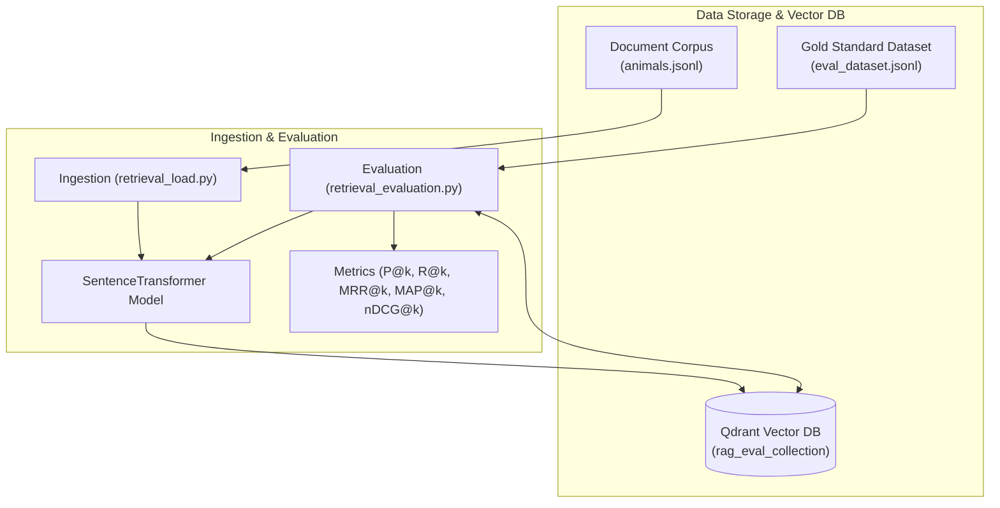

# RAG Evaluation System

This project provides an evaluation framework for Retrieval-Augmented Generation (RAG) systems. It focuses on evaluating the quality of document retrieval using semantic search with vector embeddings stored in Qdrant.

## Overview

The system evaluates retrieval performance by:
1. **Loading documents** into a vector database (Qdrant) with semantic embeddings
2. **Retrieving relevant documents** for given queries using cosine similarity search
3. **Comparing retrieved results** against a gold standard dataset
4. **Calculating multiple metrics** to assess retrieval quality

## System Architecture & Sequence Diagrams

See the detailed [Architecture and Sequence Diagrams Documentation](architecture.md) for full visual breakdowns.



## Components

### 1. Data Loading (`retrieval_load.py`)

The `retrieval_load.py` script initializes the vector database and populates it with document embeddings:

- **Creates a Qdrant collection** named `rag_eval_collection` (deletes existing collection if present)
- **Loads documents** from `animals.jsonl` 
- **Generates embeddings** using the `sentence-transformers/all-MiniLM-L6-v2` model (384-dimensional vectors)
- **Stores documents** in Qdrant with:
  - Document ID (line number from JSONL file, 1-indexed)
  - Vector embedding
  - Full metadata payload (text, author, category)

**Usage:**
```bash
uv run src/svlearn_rag_eval/evaluation/retrieval_load.py
```

### 2. Evaluation (`retrieval_evaluation.py`)

The `retrieval_evaluation.py` script evaluates retrieval performance against a gold standard:

- **Loads gold standard** evaluation data from `eval_dataset.jsonl`
- **Retrieves top-k documents** for each query using semantic search
- **Calculates multiple retrieval metrics** to assess performance
- **Reports results** for k=1 to k=5 (or a specific k value)

**Usage:**
```bash
# Evaluate for k=1 to k=5 (default)
uv run src/svlearn_rag_eval/evaluation/retrieval_evaluation.py

# Evaluate for a specific k value
uv run src/svlearn_rag_eval/evaluation/retrieval_evaluation.py --k 3

# Use a custom evaluation file
uv run src/svlearn_rag_eval/evaluation/retrieval_evaluation.py --eval_file path/to/eval_dataset.jsonl
```

## Data Formats

### `animals.jsonl`

This file contains the document corpus used for retrieval evaluation. Each line is a JSON object representing a single document.

**Format:**
```json
{
  "text": "The quote or passage text",
  "author": "Author name",
  "category": "Category/theme name"
}
```

**Fields:**
- `text` (string): The main content of the document - a quote or passage about animals
- `author` (string): The author or source of the quote
- `category` (string): The thematic category (e.g., "Wisdom and Philosophy", "Literary Passages", "Proverbs and Sayings")

**Example:**
```json
{"text": "The greatness of a nation and its moral progress can be judged by the way its animals are treated.", "author": "Mahatma Gandhi", "category": "Wisdom and Philosophy"}
```

**Note:** The document ID used in the evaluation corresponds to the line number in this file (1-indexed). For example, the first line is document ID 1, the second line is document ID 2, etc.

### `eval_dataset.jsonl`

This file contains the gold standard evaluation dataset with queries and their relevant documents. Each line is a JSON object representing a single evaluation query.

**Format:**
```json
{
  "query": "The query string to evaluate",
  "neighbors": [[document_id, relevance_score], ...]
}
```

**Fields:**
- `query` (string): The search query to be evaluated
- `neighbors` (array): A list of relevant documents, where each element is `[document_id, relevance_score]`
  - `document_id` (integer): The ID of the relevant document (corresponds to line number in `animals.jsonl`)
  - `relevance_score` (integer): The relevance score for this document (higher = more relevant)
    - Typically ranges from 1-3, where 3 = highly relevant, 2 = moderately relevant, 1 = somewhat relevant

**Example:**
```json
{"query": "Why is the ethical treatment of animals considered a measure of humanity?", "neighbors": [[18, 2], [87, 2], [2, 1]]}
```

This example indicates:
- Query: "Why is the ethical treatment of animals considered a measure of humanity?"
- Document 18 is moderately relevant (score: 2)
- Document 87 is moderately relevant (score: 2)
- Document 2 is somewhat relevant (score: 1)

**Important:** The `neighbors` list should be sorted by relevance (descending) for optimal metric calculations, though the evaluation script will sort them automatically.

## Evaluation Metrics

The system calculates five standard retrieval metrics:

### 1. Precision@k

**Definition:** The fraction of retrieved documents (in the top k) that are relevant.

**Formula:** `Precision@k = (Number of relevant documents in top k) / k`

**Interpretation:** Higher is better. Measures how many of the retrieved documents are actually relevant. Range: 0.0 to 1.0.

### 2. Recall@k

**Definition:** The fraction of all relevant documents that are retrieved in the top k.

**Formula:** `Recall@k = (Number of relevant documents in top k) / (Total number of relevant documents)`

**Interpretation:** Higher is better. Measures how many relevant documents were found. Range: 0.0 to 1.0.

### 3. MRR@k (Mean Reciprocal Rank)

**Definition:** The average of the reciprocal ranks of the first relevant document across all queries.

**Formula:** For each query, find the rank `r` of the first relevant document. MRR = `1/r` if found in top k, else 0. Average across all queries.

**Interpretation:** Higher is better. Emphasizes finding at least one relevant document early. Range: 0.0 to 1.0.

### 4. MAP@k (Mean Average Precision)

**Definition:** The mean of Average Precision scores across all queries, where Average Precision considers the precision at each position where a relevant document is found.

**Formula:** For each query, calculate precision at each position where a relevant document appears, then average these precisions. MAP is the mean across all queries.

**Interpretation:** Higher is better. Balances precision and recall, rewarding systems that rank relevant documents higher. Range: 0.0 to 1.0.

### 5. nDCG@k (Normalized Discounted Cumulative Gain)

**Definition:** A ranking quality metric that considers the position and relevance score of documents.

**Formula:** 
- **DCG (Discounted Cumulative Gain):** Sum of `relevance_score / log2(position + 1)` for top k documents
- **IDCG (Ideal DCG):** DCG of the ideal ranking (documents sorted by relevance descending)
- **nDCG:** `DCG / IDCG`

**Interpretation:** Higher is better. The only metric that uses actual relevance scores (not just binary relevance), making it more nuanced. Range: 0.0 to 1.0.

**Note:** Unlike other metrics that treat documents as binary (relevant/not relevant), nDCG uses the actual relevance scores from the gold standard, giving more weight to highly relevant documents.

## Workflow

1. **Setup Qdrant:** Ensure Qdrant is running on `localhost:6333`  
2. **Load documents:** Run `retrieval_load.py` to populate the vector database
3. **Run evaluation:** Execute `retrieval_evaluation.py` to evaluate retrieval performance
4. **Analyze results:** Review the metrics to understand retrieval quality


## Dependencies

- `qdrant-client`: Vector database client
- `sentence-transformers`: For generating embeddings
- `numpy`: For numerical operations
- `python-dotenv`: For environment variable management

## Configuration

The system uses:
- **Embedding model:** `sentence-transformers/all-MiniLM-L6-v2` (384 dimensions)
- **Vector database:** Qdrant (localhost:6333)
- **Collection name:** `rag_eval_collection`
- **Distance metric:** Cosine similarity

---

## Steps

Before starting:
- `uv sync`
- update `.env`

```
docker pull qdrant/qdrant
docker run -p 6333:6333 -p 6334:6334 -v "$(pwd)/qdrant_storage:/qdrant/storage:z" qdrant/qdrant
```
Ensure Qdrant is running on `localhost:6333`

### Animals quotes

#### Load
```
uv run ./src/svlearn_rag_eval/evaluation/retrieval_load.py
```
#### Evaluate
```
uv run ./src/svlearn_rag_eval/evaluation/retrieval_evaluation.py
```

### MSMARCO

#### Download the dataset
```
cd ./data 
wget https://public.ukp.informatik.tu-darmstadt.de/thakur/BEIR/datasets/msmarco.zip
unzip msmarco.zip
cd ../
```
#### Load
```
uv run ./src/svlearn_rag_eval/evaluation/msmacro_retrieval_load.py
```
#### Evaluate
```
uv run ./src/svlearn_rag_eval/evaluation/msmacro_retrieval_evaluation.py
```