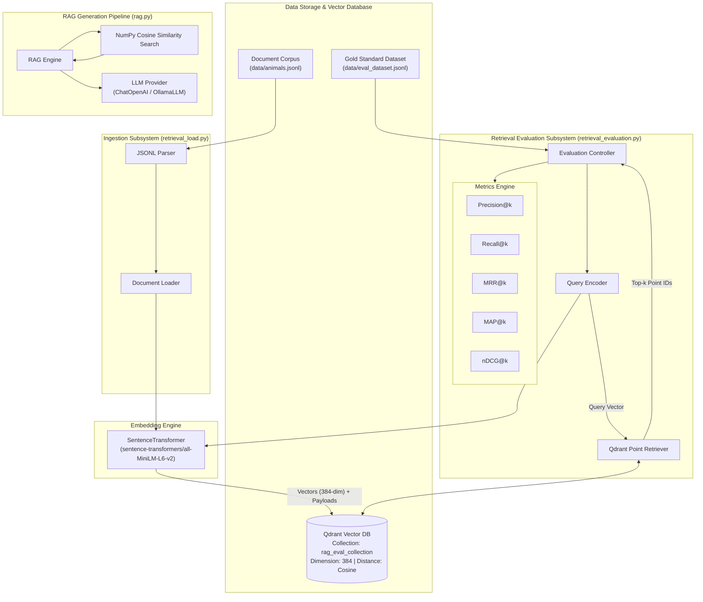
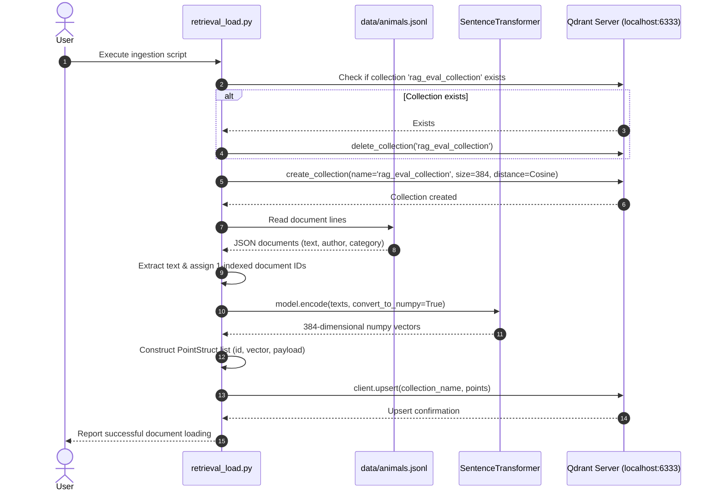
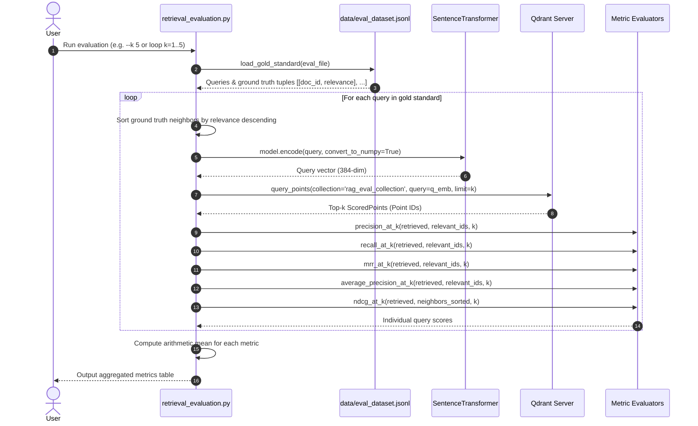
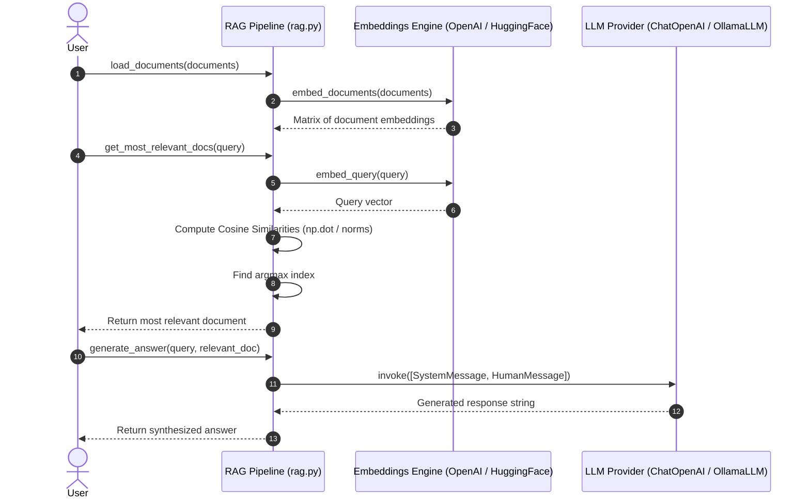

# System Architecture & Sequence Diagrams

This document describes the high-level architecture and execution flows of the **RAG Evaluation System**.

---

## 1. System Architecture Diagram

The system comprises three main layers:
1. **Data & Storage Layer**: Source document corpus (`animals.jsonl`), evaluation dataset (`eval_dataset.jsonl`), and the vector database (Qdrant `rag_eval_collection`).
2. **Embedding & Ingestion Layer**: Semantic embedding generator using `SentenceTransformer("sentence-transformers/all-MiniLM-L6-v2")` and Qdrant ingestion client (`retrieval_load.py`).
3. **Retrieval Evaluation & RAG Pipeline Layer**:
   - **Evaluation Subsystem** (`retrieval_evaluation.py`): Vector search retriever, gold-standard sorting, and multi-metric calculator (`Precision@k`, `Recall@k`, `MRR@k`, `MAP@k`, `nDCG@k`).
   - **RAG Subsystem** (`rag.py`): In-memory document similarity matching and response synthesis via OpenAI or Ollama LLMs.

---

## 2. Sequence Diagrams

### 2.1 Document Ingestion & Indexing Flow (`retrieval_load.py`)

This workflow reads documents from `data/animals.jsonl`, initializes or resets the Qdrant vector collection, computes 384-dimensional embeddings, and upserts points with text payloads and line-number document IDs.

---

### 2.2 Retrieval Evaluation Flow (`retrieval_evaluation.py`)

This workflow evaluates retrieval performance against `data/eval_dataset.jsonl` across various values of \(k\) (1 to 5). It measures Precision@k, Recall@k, MRR@k, MAP@k, and nDCG@k.

---

### 2.3 RAG Answer Generation Flow (`rag.py`)

This workflow demonstrates an end-to-end RAG pipeline using in-memory vector dot product matching and LLM response generation via LangChain with OpenAI or Ollama.

