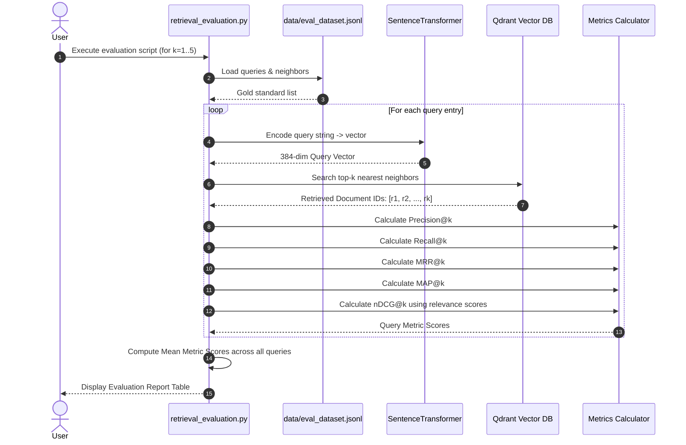

# Dataset Creation & Evaluation Methodology Guide

This guide explains how the document corpus (`data/animals.jsonl`) and evaluation dataset (`data/eval_dataset.jsonl`) are structured, how relevance scores are assigned, and how the retrieval evaluation process operates step-by-step.

---

## 1. Document Corpus Creation (`data/animals.jsonl`)

The document corpus serves as the knowledge base for semantic retrieval evaluation.

### Schema
Each line in `data/animals.jsonl` is a standalone JSON object:
```json
{
  "text": "The greatness of a nation and its moral progress can be judged by the way its animals are treated.",
  "author": "Mahatma Gandhi",
  "category": "Wisdom and Philosophy"
}
```

### Document ID Mapping
- Documents are indexed automatically based on their **1-indexed line number** in `animals.jsonl`.
  - Line 1 = Document ID `1`
  - Line 18 = Document ID `18`
  - Line 87 = Document ID `87`

### Ingestion into Vector Database (`retrieval_load.py`)
1. Reads each line from `data/animals.jsonl`.
2. Encodes document text into a 384-dimensional dense vector using `SentenceTransformer("sentence-transformers/all-MiniLM-L6-v2")`.
3. Creates/resets Qdrant vector collection `rag_eval_collection` using Cosine distance metric.
4. Stores point payload containing:
   - `id`: Document ID (line number)
   - `text`, `author`, `category`

---

## 2. Evaluation Dataset Creation (`data/eval_dataset.jsonl`)

The gold-standard evaluation dataset defines search queries alongside ground-truth relevant documents and their graded relevance scores.

### Schema
```json
{
  "query": "Why is the ethical treatment of animals considered a measure of humanity?",
  "neighbors": [[18, 2], [87, 2], [2, 1]]
}
```

### Neighbor Tuple Structure: `[document_id, relevance_score]`
- **`document_id`**: The line number ID in `animals.jsonl`.
- **`relevance_score`**: The ground-truth relevance rating.

### Relevance Score Grading Scale
Relevance scores are annotated on a graded scale:

| Score | Rating | Definition | Example for Query: *"Ethical treatment of animals"* |
| :---: | :--- | :--- | :--- |
| **3** | **Perfect Match** | Complete, precise answer to the query. | Direct quote on animal ethics and human progress. |
| **2** | **Highly Relevant** | Directly addresses the topic with strong semantic alignment. | Doc 18 (*Kant: "judge the heart of a man by treatment of animals"*) & Doc 87 (*Gandhi: "greatness of humanity... in being humane"*). |
| **1** | **Marginally Relevant** | Related theme but secondary focus. | Doc 2 (*Orwell: "All animals are equal..."*). |
| **0** | **Irrelevant** | Unrelated to the query (omitted from `neighbors`). | Quotes about birds singing or dogs running. |

### Annotation Methodologies
Relevance scores in gold-standard datasets are established via:
1. **Human Expert Annotation**: Human domain experts grade candidate documents for each query.
2. **LLM-as-a-Judge**: High-capacity LLMs (e.g. GPT-4) judge query-document pairs against explicit relevance rubrics.
3. **Click & Citation Data**: Derived from search logs or citations in benchmark datasets like MS MARCO.

---

## 3. End-to-End Evaluation Process (`retrieval_evaluation.py`)

Evaluation measures how effectively the vector search engine retrieves relevant documents for test queries.

### Evaluation Workflow



---

## 4. Evaluation Metrics Explained

### 1. Precision@k
- **Formula**: `Precision@k = (Number of relevant documents in top k) / k`
- **Purpose**: Measures the purity of the top-$k$ search results.
- **Range**: 0.0 to 1.0 (Higher is better).

### 2. Recall@k
- **Formula**: `Recall@k = (Number of relevant documents in top k) / (Total ground-truth relevant documents)`
- **Purpose**: Measures how many of all true relevant documents were found.
- **Range**: 0.0 to 1.0 (Higher is better).

### 3. MRR@k (Mean Reciprocal Rank)
- **Formula**: `Reciprocal Rank = 1 / (Rank position of the FIRST relevant document)`
- **Purpose**: Measures how quickly the user sees their first relevant result.
- **Range**: 0.0 to 1.0 (Higher is better).

### 4. MAP@k (Mean Average Precision)
- **Formula**: Average of Precision at each position where a relevant document appears.
- **Purpose**: Evaluates both precision and ranking order of all relevant items.
- **Range**: 0.0 to 1.0 (Higher is better).

### 5. nDCG@k (Normalized Discounted Cumulative Gain)
- **Formula**:
  $$\text{DCG}@k = \sum_{i=1}^{k} \frac{\text{rel}_i}{\log_2(i + 1)}$$
  $$\text{nDCG}@k = \frac{\text{DCG}@k}{\text{IDCG}@k}$$
  *(where $\text{rel}_i$ is the relevance score of the document at rank $i$, and $\text{IDCG}@k$ is the Ideal DCG sorted by highest relevance score first).*
- **Purpose**: Evaluates ranking quality using **graded relevance scores** (`2`, `2`, `1`), penalizing lower placement of highly relevant documents.
- **Range**: 0.0 to 1.0 (Higher is better).
