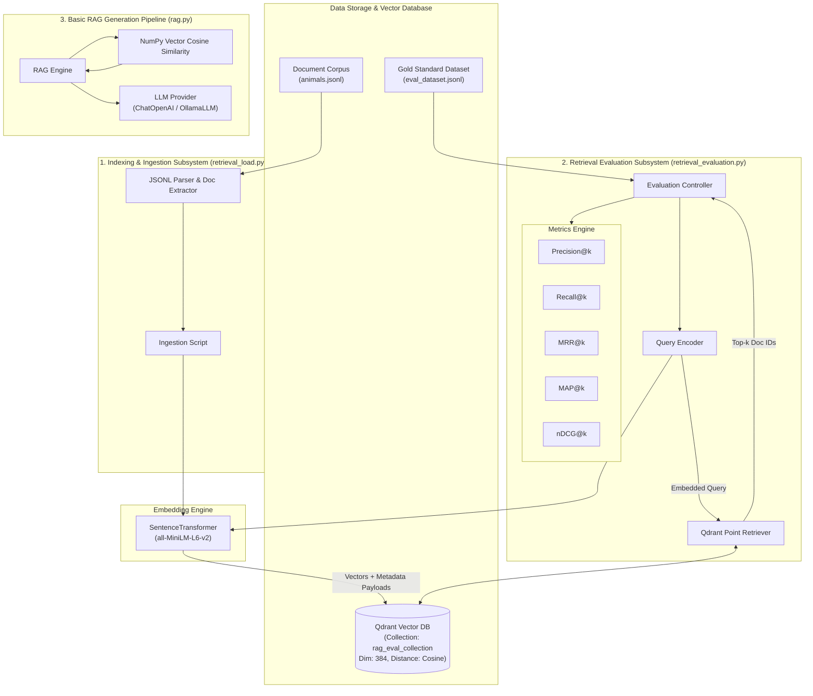
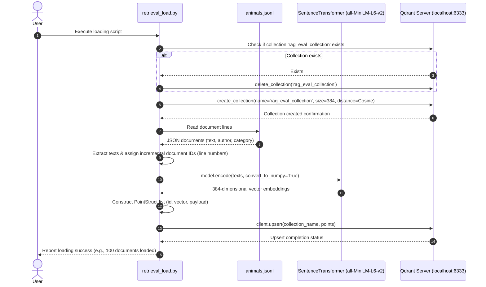
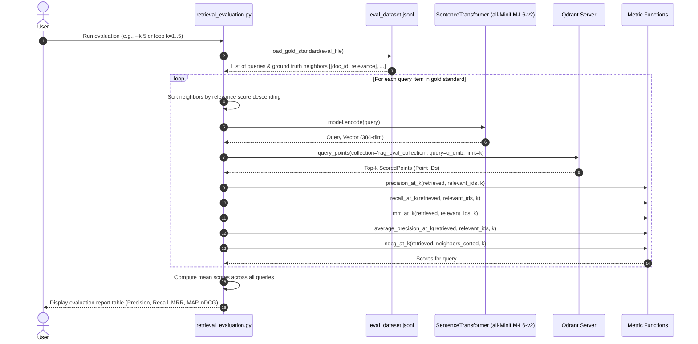
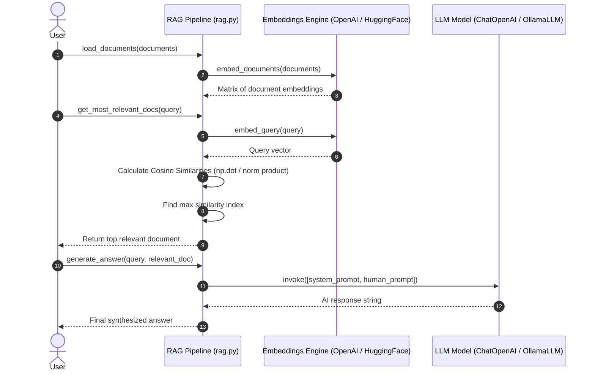

# System Architecture and Sequence Diagrams Implementation Plan

This implementation plan outlines the system architecture diagram and sequence diagrams for the RAG Evaluation System project.

## Proposed Diagrams Overview

### 1. High-Level Architecture Diagram
Visualizes the overall system structure, covering:
- **Data Layer**: Raw JSONL corpora (`animals.jsonl`) and Gold Standard Evaluation data (`eval_dataset.jsonl`).
- **Embedding & Vector DB Layer**: `SentenceTransformer` (`all-MiniLM-L6-v2`) and `Qdrant` vector database (`rag_eval_collection`).
- **Evaluation Engine Layer**: Top-K retrieval, sorting gold standard neighbors, and evaluating retrieval quality metrics (`Precision@k`, `Recall@k`, `MRR@k`, `MAP@k`, `nDCG@k`).
- **RAG Generation Layer (`rag.py`)**: Document similarity search and LLM answer synthesis (`ChatOpenAI` / `OllamaLLM`).

---

### 2. Sequence Diagrams

#### Diagram A: Document Ingestion & Indexing Sequence (`retrieval_load.py`)

#### Diagram B: Retrieval Evaluation Sequence (`retrieval_evaluation.py`)

#### Diagram C: End-to-End RAG Generation Sequence (`rag.py`)

---

## Target Documents

- [architecture.md](architecture.md): Contains system architecture and sequence diagrams.
- [README.md](README.md): Links to `architecture.md` with overview diagram embedded.
